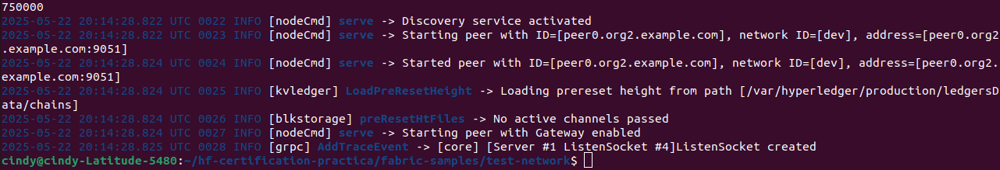

# Requisitos Previos

Antes de comenzar, asegúrate de tener instaladas las siguientes herramientas en tu sistema Ubuntu 22.04:

1. Git: Control de versiones.  
2. cURL: Herramienta para transferencias de datos.  
3. Docker: Plataforma de contenedores.  
4. Docker Compose: Herramienta para definir y correr aplicaciones Docker multi-contenedor.  
5. Go (Golang): Lenguaje de programación requerido por Hyperledger Fabric.  

---

## Clonar el Repositorio de Merca-link

Clona el repositorio proporcionado por Merca-link y navega al directorio correspondiente:

```bash
git clone https://github.com/KeepCodingBlockchain-I/hf-certification-practica.git
cd hf-certification-practica/merca-chain
```

### 1. Ejecuta el script oficial para descargar los binarios

```bash
curl -sSLO https://raw.githubusercontent.com/hyperledger/fabric/main/scripts/install-fabric.sh && chmod +x install-fabric.sh
./install-fabric.sh b
```

### 2. Copiar la carpeta bin y config de fabric-samples al directorio raíz del proyecto de Merca-link

```bash
cp -rp ~/fabric-samples/bin ./bin
cp -rp ~/fabric-samples/config ./config
```

### 3. Permisos de ejecución

```bash
chmod +x network.sh
cd scripts
sudo chmod +x *
```

### 4. Agrega los binarios al PATH

```bash
cd ~/hf-certification-practica
echo 'export PATH=$PATH:$HOME/fabric-samples/bin' >> ~/.bashrc
source ~/.bashrc
```

### 5. Levantar la red

```bash
cd merca-chain
./network.sh up -ca
```

### 6. Verificación

```bash
docker ps
```

---

## PRIMER ERROR

```text
peer0.org1.example.com    Exited (1)
orderer.example.com       Exited (2)
```

### 7. Identificar los logs

```bash
docker logs <peer_container_id>
docker logs <orderer_container_id>
```

**peer0.org1.example.com:**

```
Error loading TLS key (open /etc/hyperledger/fabric/tls/server.key: no such file or directory)
```

Solución: corregir ruta mal escrita `etc/hypreledger/fabric` por `/etc/hyperledger/fabric`.

**orderer.example.com:**

```
failed to start admin server: open /var/hyperledger/orderer/tls/servre.crt: no such file or directory
```

Solución: corregir `/tls/servre.crt` por `/tls/server.crt`.

---

### Tumbar la red y volver a levantarla

```bash
./network.sh down
./network.sh up -ca
docker ps -a
```

**Resultado:**  


---

## Ejercicio 2

**Enunciado:**  
Despliega el chaincode “merca-chaincode”. Aunque el proceso de ciclo de vida del chaincode es satisfactorio, parece que este no se despliega correctamente. Identifica el/los problemas y resuélvelos. Documenta este proceso de investigación y resolución.

### Solución

```bash
./network.sh createChannel
./network.sh deployCC -ccn merca-chaincode -ccl javascript -ccv 1.0.0 -ccp ../merca-chaincode
```

**Error:**

```
docker build failed: Failed to pull hyperledger/fabric-nodeenv:3.1: manifest unknown
```

**Solución:**

- Agregar llave faltante `}` en `lib/assetTransfer.js`, línea 89.
- Recompilar con nueva versión:

```bash
./network.sh deployCC -ccn merca-chaincode -ccl javascript -ccv 1.0.1 -ccs 2 -ccp ../merca-chaincode
```

**Resultado:**  


---

## Ejercicio 3

**Enunciado:**  
Modificar el logging para:

- Orderers → JSON
- Peers → timestamp al final + nivel DEBUG
- gossip: WARNING, chaincode: INFO

### Solución

Edita `compose/compose-test-net.yaml`:

```yaml
FABRIC_LOGGING_FORMAT=json
FABRIC_LOGGING_SPEC=debug:gossip=warning:chaincode=info
FABRIC_LOGGING_FORMAT='%{color} [%{module}] %{shortfunc} -> %{level:.4s} %{id:03x}%{color:reset} %{message} %{time:2006-01-02 15:04:05.000 MST}'
```

Reinicia la red:

```bash
./network.sh down
./network.sh up -ca
```

**Resultados:**  
  
  
  
  


---

## Ejercicio 4

**Enunciado:**  
Acoplar un HSM (SoftHSM2) a las CA para proteger claves privadas.

### Solución

```bash
sudo apt install softhsm2
export SOFTHSM2_CONF=/etc/softhsm2.conf

cd /home/cindy
mkdir tokens
```

Editar `/etc/softhsm2.conf`:

```ini
directories.tokendir = /home/cindy/tokens
objectstore.backend = file
log.level = ERROR
slots.removable = false
```

Inicializar tokens:

```bash
softhsm2-util --init-token --slot 0 --label fabric
softhsm2-util --init-token --slot 1 --label fabric1
softhsm2-util --init-token --slot 2 --label fabric2
```

**Resultado:**  


Reconstrucción de Fabric CA:

```bash
docker image ls
docker image rm <ID_IMAGE>
git clone https://github.com/hyperledger/fabric-ca.git
cd fabric-ca
make docker GO_TAGS=pkcs11
```

**Resultado:**  
  


Configuración aplicada a:

- `org1/fabric-ca-server-config.yaml`
- `org2/fabric-ca-server-config.yaml`
- `ordererOrg/fabric-ca-server-config.yaml`

Pero la red no levanta con CA:  
  


---

## Ejercicio 5

**Enunciado:**  
Configurar `fabric-ca-client` para usar SoftHSM2 y registrar usuario `merca-admin` con clave `merka-12345`.

**Resultado:**  
No fue posible completar el registro debido a que los contenedores CA no se levantaron correctamente.


---

## Ejercicio 6

**Enunciado:**  
Desplegar instancias de Prometheus y Grafana para monitoreo.

### Resultado

  

